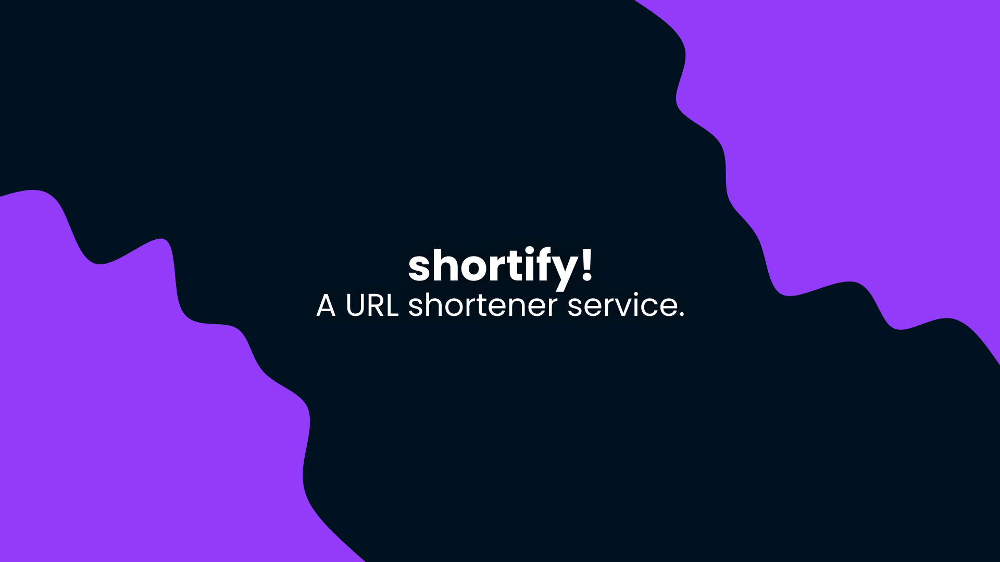

# shortify!
An easy to use URL shortener!

### Setup
- Download the source code.
- Run `npm i` to install the required packages.
- Configure the port and domain in `data/config.json`
- Run `node .` to start the server.